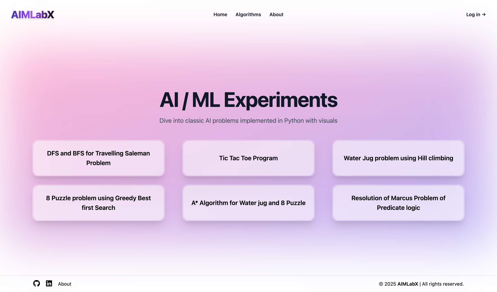

# 🧠 AIMLabX

An interactive visualizer for classic AI problems like **TSP**, **Tic Tac Toe**, **Water Jug**, **8 Puzzle**, and **Predicate Logic Resolution** — all in one platform built with **React + Flask**.



---

## 📚 Table of Contents

- ⚙️ Tech Stack
- 🚀 Features
- 🧪 AI/ML Problems Included
- 🛠️ Run Locally
- 🌐 Deployment
- 🙌 Credits
- 📜 License

---

## ⚙️ Tech Stack

- **Frontend**: ReactJS, Tailwind CSS, Framer Motion
- **Backend**: Python Flask, NLTK, Custom AI algorithms
- **Others**: REST APIs, Axios, Glassmorphism UI

---

## 🚀 Features

- 🎯 Visualize AI algorithms in real-time
- 🧠 Understand core concepts like DFS, BFS, Minimax, A*, etc.
- 📊 Solve logic problems with a Predicate Resolver (NLTK)
- 🎨 Elegant and animated UI (with hover effects and glass blur)
- 📱 Fully responsive design

---

## 🧪 AI/ML Problems Included

- ✔️ **DFS and BFS** for Travelling Salesman Problem
- ✔️ **Tic Tac Toe** (PvP and Vs Computer with Minimax)
- ✔️ **Water Jug** Problem using Hill Climbing
- ✔️ **8 Puzzle** using Greedy Best First Search
- ✔️ **A\*** Algorithm for 8 Puzzle and Water Jug
- ✔️ **Marcus Logic Resolver** using NLTK's Predicate Logic

---

### 🛠️ Run Locally

1. Clone the repository:

```bash
git clone https://github.com/22kartikeya/AIMLabX.git
```

2. Navigate to the project directory:

```bash
cd AIMLabX
```

3. Navigate to the backend directory:

```bash
cd be
```

4. Create a virtual environment:

-   On macOS and Linux:

```bash
python3 -m venv venv
```

-   On Windows:

```bash
python -m venv venv
```

5. Activate the virtual environment:

-   On macOS and Linux:

```bash
source venv/bin/activate
```

-   On Windows:

```bash
venv\Scripts\activate
```

6. Install the dependencies:

-   On macOS and Linux:

```bash
pip3 install -r requirements.txt
```

-   On Windows:

```bash
pip install -r requirements.txt
```

7. Navigate to the frontend directory:

```bash
cd ../fe
```

8. Install the dependencies:

```bash
npm install
```

9. Run the frontend:

```bash
npm run dev
```

10. Navigate to the backend directory:

```bash
cd ../be
```

11. Run the Flask app:

```bash
flask run
```

12. Open your browser and go to `http://localhost:5173/` to view the app.

---

## 🌐 Deployment

The entire project is deployed using **[Render](https://render.com)** for both frontend and backend.

🔗 **Live Demo:** [https://aimlabx.onrender.com](https://aimlabx.onrender.com)
---

## 🙌 Credits

Made with ❤️ by [Kartikeya Gupta](https://github.com/22kartikeya)
🔗 [LinkedIn](https://www.linkedin.com/in/kartikeya-gupta-81a421251)

---

## 📄 License

This project is licensed under the [MIT License](./LICENSE).

MIT License © 2025 Kartikeya Gupta  
Permission is hereby granted, free of charge, to any person obtaining a copy  
of this software and associated documentation files (the "Software"), to deal  
in the Software without restriction, including without limitation the rights  
to use, copy, modify, merge, publish, distribute, sublicense, and/or sell  
copies of the Software, and to permit persons to whom the Software is  
furnished to do so, subject to the following conditions:

> The above copyright notice and this permission notice shall  
> be included in all copies or substantial portions of the Software.

**THE SOFTWARE IS PROVIDED "AS IS", WITHOUT WARRANTY OF ANY KIND**, EXPRESS OR  
IMPLIED, INCLUDING BUT NOT LIMITED TO THE WARRANTIES OF MERCHANTABILITY,  
FITNESS FOR A PARTICULAR PURPOSE AND NONINFRINGEMENT. IN NO EVENT SHALL THE  
AUTHORS OR COPYRIGHT HOLDERS BE LIABLE FOR ANY CLAIM, DAMAGES OR OTHER  
LIABILITY, WHETHER IN AN ACTION OF CONTRACT, TORT OR OTHERWISE, ARISING FROM,  
OUT OF OR IN CONNECTION WITH THE SOFTWARE OR THE USE OR OTHER DEALINGS IN THE SOFTWARE.